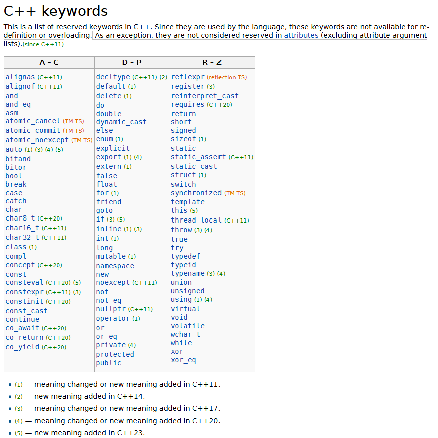

# C++ Course

[Obtain Modern C++ Object-Oriented Programming (OOP) and STL skills. C++14 and C++17 covered.](https://www.udemy.com/course/beginning-c-plus-plus-programming/learn/lecture/9535214#overview)


## Seção 5 - Estrutura do programa em C++

### Keywords



### Macros predefinidas

```cpp
int main () {

   cout << "Value of __LINE__ : " << __LINE__ << endl;
   cout << "Value of __FILE__ : " << __FILE__ << endl;
   cout << "Value of __DATE__ : " << __DATE__ << endl;
   cout << "Value of __TIME__ : " << __TIME__ << endl;

   return 0;
}
```
    Value of __LINE__ : 6
    Value of __FILE__ : test.cpp
    Value of __DATE__ : Feb 28 2011
    Value of __TIME__ : 18:52:48

### Namespace

É possivel utilizar os namespace qualificados para que não ocorra o conflito de uma biblioteca inteira.

```cpp
using std::cout;
using std::cin;
using std::endl;
```